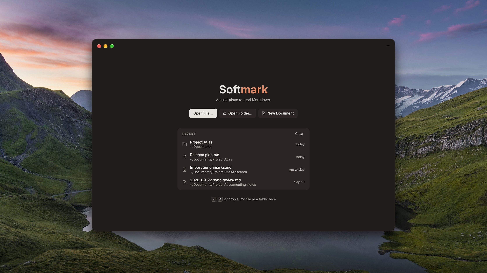
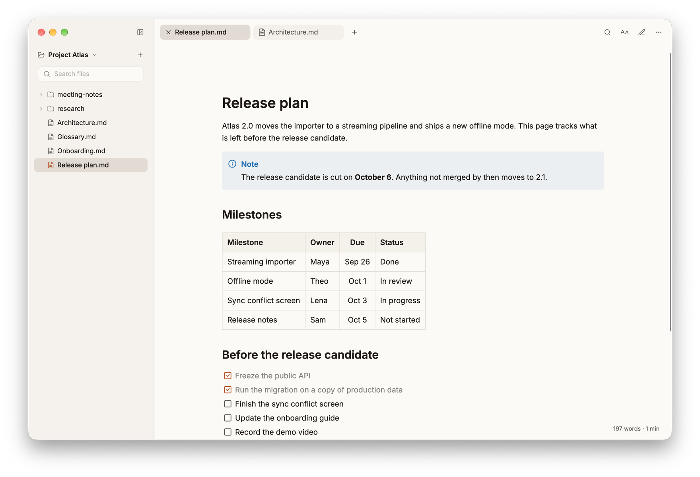
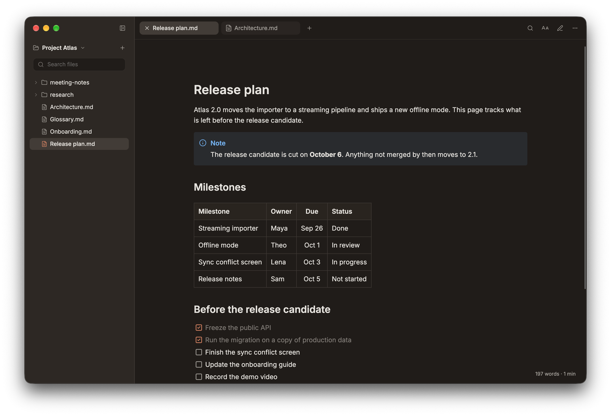
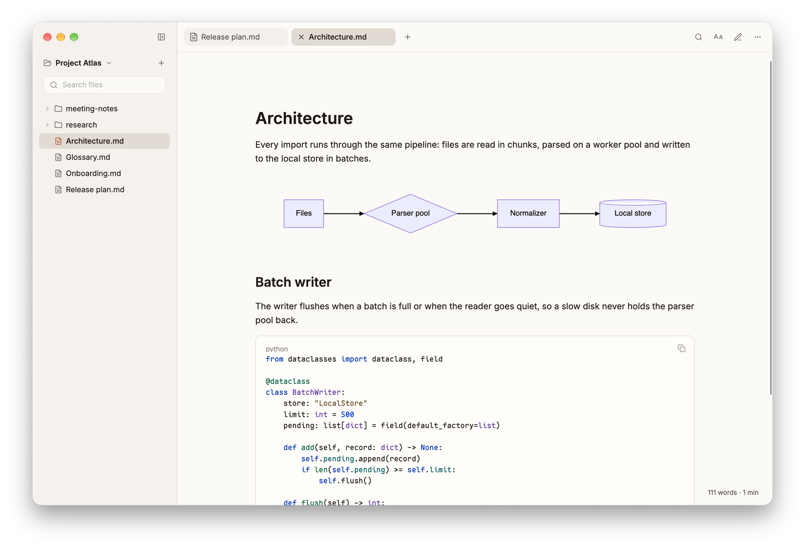

# Softmark

**A fast Markdown viewer for macOS, Windows and Linux.**

Softmark opens `.md` files straight into a clean reading view: rendered tables,
Mermaid diagrams and code with syntax highlighting, in a light or dark theme.
Editing is one shortcut away, but it never gets in the way of reading. It is a
native desktop app with no browser engine inside, so documents open in a moment.

[Download](../../releases/latest) · [Screenshots](#screenshots) · [Build from source](#build-from-source)



## Features

- **Reading first.** A file opens in reading mode; the editor stays off until you ask for it.
- **GitHub Flavored Markdown.** Tables, task lists, footnotes, alerts (`> [!NOTE]`),
  definition lists, strikethrough, highlight, subscript and superscript, YAML front matter.
- **Mermaid diagrams.** Flowcharts, sequence, class, ER, Gantt, pie, git graph, mind map
  and more, rendered offline inside the app.
- **Syntax highlighting.** Code blocks use the language grammars of Visual Studio Code
  and have a copy button.
- **Tabs and folders.** Open several documents in tabs, or open a whole folder of notes
  with a file panel, file search and basic file operations. In a folder, edits made by
  other programs show up in the open document on their own.
- **Reading settings.** Light, dark or system theme; serif, sans or mono font; text size,
  line height and line width.
- **Find in document**, word count and reading time.
- **Editing mode** with the Markdown source and a live preview side by side.
- **Recent files and folders** on the welcome screen; drop a `.md` file or a folder
  anywhere on the window to open it.
- English and Russian interface.

## How it differs

Softmark is a Markdown reader that can edit, not an editor that can preview.

- **Typora** makes you read and write in the same WYSIWYG surface. Softmark keeps
  reading and editing apart: you read a clean document and switch to the source
  only when you mean to change it.
- **Obsidian** is a knowledge base: vaults, links between notes, plugins. Softmark
  has none of that. Double-click a `.md` file anywhere on disk and it opens for
  reading, with no vault to set up first.
- **MacDown** is a macOS-only editor with a preview pane. Softmark runs on macOS,
  Windows and Linux and opens a file for reading first.

Typora and Obsidian are built on Electron, and MacDown renders its preview in a web
view. Softmark is compiled to native code and draws the document itself, including
Mermaid diagrams, without a browser engine.

## Screenshots







## Installation

Download the latest build from [Releases](../../releases/latest).

### Windows

1. Download `Softmark-setup-win-x64.exe` or `Softmark-setup-win-arm64.exe`, depending on your computer architecture.
2. Run the installer.
3. Launch Softmark from the Start menu or open a `.md` file with Softmark.

### macOS

1. Download `Softmark-macos-arm64.dmg` for Apple Silicon or `Softmark-macos-x64.dmg` for Intel Mac.
2. Open the DMG.
3. Drag `Softmark.app` into `Applications`.
4. Launch the app from `Applications`.

### Linux

1. Download `Softmark-linux-x86_64.AppImage`.
2. Make it executable and run it:

```bash
chmod +x Softmark-linux-x86_64.AppImage
./Softmark-linux-x86_64.AppImage
```

The AppImage needs FUSE to mount itself. Distributions that ship only FUSE 3 need
`libfuse2` installed, or you can run the file with `--appimage-extract-and-run`.

## Temporary unsigned builds

Current public Softmark builds are temporarily distributed without a developer signature. Because of that, Windows or macOS may show a warning on first launch.

This is a temporary distribution pipeline limitation. Developer signing and the normal notarization/signing chain will be added in the future.

### Windows: bypass SmartScreen

If Windows shows a SmartScreen warning:

1. Click `More info`.
2. Click `Run anyway`.

If Windows marked the downloaded file as blocked:

1. Open the installer file properties.
2. Enable `Unblock`, if the option is available.
3. Apply the changes and run the installer again.

### macOS: bypass Gatekeeper

If macOS says the app is damaged, cannot be verified, or cannot be opened because it is from an unknown developer:

1. Open `System Settings`.
2. Go to `Privacy & Security`.
3. Find the message about blocked `Softmark`.
4. Click `Open Anyway`.
5. Confirm the launch.

If you need to remove the quarantine flag manually for a one-time test:

```bash
xattr -dr com.apple.quarantine /Applications/Softmark.app
open /Applications/Softmark.app
```

## Build from source

.NET SDK 10 is required.

```bash
dotnet restore ./MarkMello.sln
dotnet build ./MarkMello.sln
```

Run the project:

```bash
dotnet run --project ./src/MarkMello.Desktop/MarkMello.Desktop.csproj
```

Open a file from the command line:

```bash
dotnet run --project ./src/MarkMello.Desktop/MarkMello.Desktop.csproj -- ./sample.md
```

Open the showcase with the common Markdown elements, to check how each of them renders:

```bash
dotnet run --project ./src/MarkMello.Desktop/MarkMello.Desktop.csproj -- ./samples/showcase.md
```

## Keyboard shortcuts

| Action | Windows / Linux | macOS |
| --- | --- | --- |
| Open file | `Ctrl+O` | `Cmd+O` |
| Toggle editing mode | `Ctrl+E` | `Cmd+E` |
| Find in document | `Ctrl+F` | `Cmd+F` |
| Save | `Ctrl+S` | `Cmd+S` |
| Save as | `Ctrl+Shift+S` | `Cmd+Shift+S` |
| Larger text | `Ctrl+=` / `Ctrl++` | `Cmd+=` / `Cmd++` |
| Smaller text | `Ctrl+-` | `Cmd+-` |
| Reset text size | `Ctrl+0` | `Cmd+0` |
| Settings | `Ctrl+,` | `Cmd+,` |

## Ideas and suggestions

Have an idea or suggestion? Share it in [GitHub Discussions: Ideas](https://github.com/kostyatab/Softmark/discussions/categories/ideas).

## License

The project is distributed under the GPL-3.0 license.

See [LICENSE](LICENSE).

Softmark is a fork of [MarkMello](https://github.com/dartdavros/MarkMello) by the MarkMello contributors.

## Acknowledgements

Diagram support in Softmark is built on open-source projects:

- [Naiad](https://github.com/Papyrine/Naiad) — a .NET library that renders Mermaid diagrams to SVG in-process, without a browser or external runtime. MIT License.
- [Mermaid](https://github.com/mermaid-js/mermaid) — diagram syntax and specification.

Syntax highlighting in code blocks is built on:

- [TextMateSharp](https://github.com/danipen/TextMateSharp) — a .NET port of the TextMate grammar engine; its grammar package bundles the language grammars of [Visual Studio Code](https://github.com/microsoft/vscode). MIT License.
- [Onigwrap](https://github.com/aikawayataro/Onigwrap) — a .NET wrapper for the [Oniguruma](https://github.com/kkos/oniguruma) regular expression library. MIT License; Oniguruma is under the BSD 2-Clause License.

The background of the cover image is a [photo by Ansgar Scheffold](https://unsplash.com/photos/z_f2JrBRbOg) on Unsplash, used under the [Unsplash License](https://unsplash.com/license).

Interface icons come from [Lucide](https://lucide.dev) — ISC License (icons inherited from Feather are MIT); the full notice is in [LUCIDE_LICENSE.txt](src/MarkMello.Presentation/Themes/LUCIDE_LICENSE.txt).
