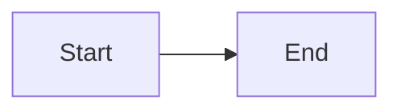
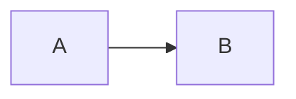

# ADR-0005: Diagram blocks and Mermaid rendering

## Status

Утвержден

## Date

2026-05-10

## Context

MarkMello уже имеет собственный native Markdown pipeline:

- `MarkMello.Infrastructure/Markdown/MarkdigMarkdownDocumentRenderer.cs` разбирает Markdown через Markdig и переводит AST в UI-agnostic модель;
- `MarkMello.Domain/RenderedMarkdownDocument.cs` содержит `RenderedMarkdownDocument`, `MarkdownBlock`, `MarkdownInline` и конкретные block-типы;
- `MarkMello.Presentation/Views/MarkdownDocumentView.cs` строит нативное Avalonia-представление поверх `RenderedMarkdownDocument`;
- `MarkdownSourceSpan` уже используется для связи preview-блоков с исходными строками в edit-mode scroll synchronization;
- `MarkdownImageBlock` уже показывает подход для special block, который является частью документа, но не обязан входить в continuous text selection flow.

Сейчас fenced code block вида:

````markdown

````

обрабатывается как обычный `MarkdownCodeBlock` и отображается как code block.

Это корректно для неизвестных языков code fence, но недостаточно для diagram languages. Mermaid должен отображаться как диаграмма, а не как исходный код, если dialect объявлен поддержанным.

Дополнительно известно, что Mermaid не должен проектироваться как разовая частная фича. Следующим dialect планируется PlantUML, затем возможны другие diagram languages. Поэтому архитектура должна сразу вводить общий слой diagram blocks, а не `MarkdownMermaidBlock`, который потом придётся переделывать.

Ограничения продукта и архитектуры:

- MarkMello остаётся viewer-first Markdown reader;
- fast path `open file -> readable document` не должен получать editor/browser/runtime tax;
- edit mode не должен становиться зависимостью viewer mode;
- базовый сценарий остаётся local-first и file-first;
- сетевой renderer не допускается;
- WebView/HTML viewer не является целевым rendering path;
- Node/Puppeteer/Chromium/external process не должны становиться штатной зависимостью Mermaid support;
- Native AOT direction должен сохраняться.

## Decision

Вводится first-class архитектура diagram blocks в Markdown pipeline.

Mermaid становится первым поддержанным diagram dialect.

Для Mermaid принимается bundled .NET renderer на базе Naiad.

### 1. Diagram block is a common domain concept

В domain-модель добавляется общий diagram block, рассчитанный не только на Mermaid:

```text
MarkdownDiagramBlock
- Kind
- Source
- RenderResult
- Info
- Title
- SourceSpan
```

Рабочая модель:

```text
MarkdownDiagramKind
- Mermaid
- PlantUml
```

`PlantUml` допускается в enum как будущий dialect, но не считается поддержанным до отдельного ADR и выбора обязательного renderer backend.

Принцип:

- `MarkdownDiagramBlock` является частью `RenderedMarkdownDocument`;
- Mermaid не получает отдельный `MarkdownMermaidBlock` как доменный тупик;
- будущие dialects добавляются через тот же diagram contract;
- Presentation не должна знать синтаксис Mermaid, PlantUML или других diagram languages.

### 2. Mermaid fenced code block is converted to diagram block

`MarkdigMarkdownDocumentRenderer` должен распознавать fenced code block с info string `mermaid`.

Правила распознавания:

- `mermaid` распознаётся case-insensitive;
- если info string содержит дополнительные токены, dialect определяется по первому токену;
- неизвестные fenced code languages остаются обычными `MarkdownCodeBlock`;
- indented code block не становится diagram block.

Пример:

````markdown

````

становится:

```text
MarkdownDiagramBlock(Kind = Mermaid, Source = "flowchart LR\n    A --> B")
```

а не `MarkdownCodeBlock`.

### 3. Supported dialect requires mandatory renderer

Для каждого dialect, объявленного поддержанным, renderer является обязательной runtime-зависимостью приложения.

Для Mermaid это означает:

```text
Mermaid support = Naiad-backed renderer bundled into MarkMello
```

Отсутствие `MermaidDiagramRenderer` в DI/composition root не является пользовательским runtime-сценарием. Это ошибка сборки, композиции или тестового окружения.

Правило:

- если dialect объявлен поддержанным, приложение должно иметь renderer для него;
- отсутствие renderer должно выявляться тестами и composition validation;
- UI не должен показывать состояние вроде “renderer is unavailable” для поддержанного dialect;
- fallback допускается только для невалидного source конкретной диаграммы или runtime-ошибки renderer.

### 4. Mermaid renderer backend is Naiad

Для Mermaid выбирается Naiad как штатный renderer backend.

Причины выбора:

- это .NET library for rendering Mermaid diagrams to SVG;
- заявлена работа без browser и JavaScript runtime;
- API возвращает SVG;
- лицензия MIT;
- подход соответствует native desktop viewer direction лучше, чем WebView, Mermaid CLI или сетевой renderer.

Архитектурная формулировка:

```text
MermaidDiagramRenderer uses Naiad to render Mermaid source into SVG.
The produced SVG is passed to the presentation layer as diagram render output.
```

### 5. Diagram rendering belongs to markdown rendering subsystem

Diagram rendering не относится к editor subsystem.

Mermaid diagrams являются частью viewer Markdown rendering path, но renderer вызывается только для реально найденных Mermaid blocks.

Следствие:

- документы без diagram blocks не платят цену Mermaid rendering;
- editor mode не инициализируется для Mermaid support;
- diagram rendering не должен тянуть toolbar, hints, autocomplete, linting или editor-specific code;
- rendering source of truth остаётся markdown pipeline, а не UI/editor layer.

### 6. Render output is UI-agnostic

Renderer не должен возвращать Avalonia controls.

Диаграмма должна пройти через UI-agnostic результат:

```text
MarkdownDiagramRenderResult
- Success(Svg)
- Failure(Message, Source)
```

или эквивалентную модель.

Presentation получает уже готовый diagram render result и строит visual:

- success: SVG/image visual внутри document flow;
- failure: error block с исходником диаграммы и диагностикой.

Runtime failure не должен разрушать весь документ.

### 7. SVG rendering stays native and AOT-safe

Так как Naiad отдаёт SVG, Presentation должна отображать SVG через native/AOT-safe путь.

Целевой путь:

- использовать существующий `AotSafeSvgImage` как основу;
- расширить его только под реально нужный SVG subset, который генерирует Naiad;
- покрыть расширения тестами;
- не заменять это WebView или HTML-rendering path.

Если Naiad генерирует SVG-конструкции, которые текущий `AotSafeSvgImage` не поддерживает, это решается расширением native SVG support в MarkMello.

Это не является основанием для перехода на WebView, Node, Chromium, Mermaid CLI или сетевой renderer.

### 8. Selection and copy semantics

Diagram visual не является обычным текстовым фрагментом документа.

Правила:

- успешная diagram visual не входит в continuous text selection flow как обычный paragraph/code text;
- source диаграммы должен быть доступен через контекстное действие или error view;
- при renderer failure error block обязан показывать исходник, чтобы пользователь не потерял содержимое документа;
- `MarkdownDocumentTextMap` не должен молча добавлять source Mermaid diagram в обычное копирование визуально выделенного текста, если пользователь выделяет не source, а rendered visual.

Это соответствует подходу special blocks: изображение/диаграмма является содержанием документа, но не обязана притворяться обычным текстовым блоком.

### 9. README acknowledgement is mandatory

После реализации Mermaid support в нижней части `README.md` и `README.en.md` должен быть добавлен блок благодарностей/credits.

Минимально должны быть упомянуты:

- Naiad — .NET Mermaid-to-SVG renderer;
- Mermaid — diagram syntax/ecosystem.

Формулировка должна быть спокойной и пользовательской, без маркетинговой воды.

### 10. Runtime upgrade to net10.0 (M0 finding, 2026-05-17)

В рамках M0 spike зафиксировано: Naiad 0.1.0–0.1.2 публикуют только `lib/net10.0/`. Других TFM (`net9.0`, `net8.0`, `netstandard2.x`) в пакете нет, что подтверждено NuGet feed и реальной ошибкой `NU1202` при попытке установки в `net9.0` проект.

Принимается решение: MarkMello переводится на `net10.0` как единый TargetFramework solution.

Обоснование:

- Naiad выбран как обязательный bundled renderer по решению 4 ADR-0005;
- по правилам M0, замена Naiad на внешний optional/network/WebView renderer запрещена без нового ADR;
- multi-targeting Naiad не контролируется проектом и не имеет анонсированных сроков;
- net10 — GA-релиз .NET (доступен на момент решения), поэтому upgrade не вводит preview-зависимость в production-путь.

Состав изменений:

- `Directory.Build.props`: `<TargetFramework>net9.0</TargetFramework>` → `net10.0`;
- `Microsoft.Extensions.DependencyInjection*` PackageReferences: `9.0.0` → `10.0.0` для соответствия рантайму;
- CI workflow `release-windows.yml`: `dotnet-version: 9.0.x` → `10.0.x`;
- Avalonia/Markdig и прочие зависимости остаются на текущих версиях, если совместимы с net10 в реальном build.

Правила:

- upgrade обязателен для всех проектов solution, а не только для Infrastructure;
- если какая-либо зависимость solution окажется несовместимой с net10, это является блокером уровня ADR, и решение либо ждёт обновления зависимости, либо пересматривается;
- никаких per-project TFM override-ов под Mermaid не вводится;
- Native AOT direction сохраняется на net10.

### 11. Naiad 1.x and the Open Source Maintenance Fee (MM-20, 2026-09-22)

Начиная с 1.0 бинарные релизы Naiad на NuGet распространяются по Open Source Maintenance Fee (EULA `OsmfEula.txt` в пакете). Исходный код остаётся под MIT. Пакет проверяет это при сборке через SponsorCheck: без лицензионного свойства сборка падает с `SC021`.

Условия EULA:

- платят только организации с годовой выручкой от US$10 000, использующие Naiad в деятельности, приносящей доход;
- для остальных издатель объявил исключение `SmallRevenue`;
- сборка из исходников и форки EULA не затрагивает.

Принимается решение: MarkMello обновляется до Naiad 1.4.0 и заявляет исключение `SmallRevenue`. MarkMello — бесплатный GPL-проект без выручки.

Состав изменений:

- `Directory.Packages.props`: `Naiad` `0.1.2` → `1.4.0`;
- `Directory.Build.props`: `<Papyrine_SponsorshipExemption>SmallRevenue</Papyrine_SponsorshipExemption>`; предупреждение `SC031` («исключение заявлено») выводится как сообщение — это уведомление, а не дефект, и `TreatWarningsAsErrors` его не касается;
- `MermaidDiagramRenderer`: пространство имён `MermaidSharp` → `Naiad`; подписи flowchart по-прежнему приходят в `<foreignObject>`, и `AotSafeSvgImage` извлекает из них текст, как с 0.1.2 — `RenderOptions` остаются по умолчанию;
- `MermaidDiagramRenderer`: SVG без единой фигуры или текста вне `<defs>` — это `Failure`. Naiad 1.x разбирает часть битых исходников (например, незакрытый узел flowchart) в пустую диаграмму вместо исключения, и пустая картинка скрыла бы исходник. У такого `Failure` причина `DiagramFailureReason.EmptyDiagram`: блок ошибки объясняет её на языке интерфейса вместо английской диагностики рендерера.

Что дало обновление (витрина `samples/showcase.md`):

- classDiagram — все классы с полями, методами и связями;
- mindmap — корень без синтаксиса формы (`root((…))`);
- journey — список актёров;
- gitGraph — подписи коммитов не перекрываются кружками;
- gantt — id задачи больше не выводится в полосе.

Известные ограничения Naiad 1.4.0, которые остаются:

- gantt: подписи дат на шкале наезжают друг на друга — так же выглядит SVG Naiad в браузере, дефект не в `AotSafeSvgImage`;
- flowchart: рёбра от ромба начинаются в стороне от его углов — тоже в SVG Naiad;
- тем нет: в `RenderOptions` нет выбора палитры, тёмная тема диаграмм решается на стороне MarkMello (Decision 12).

Правила:

- решение пересматривается, если у проекта появится выручка от US$10 000 в год (тогда — спонсорство издателя) или издатель уберёт исключение `SmallRevenue`;
- запасной путь без EULA — сборка Naiad из исходников (MIT); он требует отдельного решения, потому что добавляет поддержку чужого кода.

### 12. Diagrams in the dark theme: a light sheet (MM-13, 2026-09-22)

Naiad 1.4.0 рисует SVG только в светлой палитре Mermaid. В тёмной теме рёбра, стрелки, подписи сообщений, заголовки и легенды выходят тёмными на тёмном фоне страницы.

Рассматривались два механизма:

- перекраска SVG под тему — замена `fill`/`stroke` в атрибутах и `<style>` до передачи в `AotSafeSvgImage`;
- светлый лист под диаграммой в тёмной теме.

Перекраска отклонена: по цвету элемента нельзя понять, на чём он лежит. На 11 диаграммах `sample.md` и `samples/showcase.md` у большинства `<text>` нет `fill` (чёрный по умолчанию), а `#333` стоит и на рёбрах поверх страницы, и на тексте внутри светлых узлов (journey, classDiagram, erDiagram). Замена «тёмное → светлое» сделала бы текст в узлах светлым на светлом. Надёжная перекраска требовала бы знать раскладку каждого типа диаграмм и менялась бы с каждой версией Naiad.

Принимается решение: в тёмной теме успешная диаграмма лежит на светлом листе.

- кисть `MmDiagramBackgroundBrush` в `Themes/Colors.axaml`: в светлой теме `Transparent` (листа не видно, диаграмма лежит на странице), в тёмной — `#EAE6E0`, oklch(0.926 0.009 78), тёплый светлый тон палитры; контраст со штрихами Mermaid `#333` — не ниже 7:1;
- фон задаёт стиль `Border.mm-md-diagram-success` через `DynamicResource`: смена темы перекрашивает лист без повторного рендера SVG и без переоткрытия файла;
- поле вокруг картинки 1em и скругление как у блока кода — одинаковые в обеих темах, чтобы смена темы не сдвигала документ. Цена — в светлой теме над диаграммой и под ней на 1em больше воздуха, чем до MM-13, а горизонтальная прокрутка широкой диаграммы включается на 2em раньше;
- полоса прокрутки широкой диаграммы лежит на листе, поэтому берёт светлую тему в обеих темах приложения (`ThemeVariantScope` внутри листа): ползунок тёмной темы на светлом листе не читался бы;
- SVG не меняется: рендер остаётся ленивым и не зависит от темы, в `DiagramRenderRequest` тема не добавляется.

Правило: перекраска пересматривается, если Naiad научится выбирать палитру (`RenderOptions`) — тогда тёмная палитра Mermaid заменит лист.

### 13. Sequence diagrams: a layout layer over Naiad (MM-75, 2026-09-26)

Naiad 1.4.0 рисует `sequenceDiagram` с жёсткой геометрией: прямоугольник участника 100 px, центры через 150 px, строки через 50 px, ширина текста оценивается как `длина × размер × 0,55`. Длинные имена вылезают из прямоугольников, подписи сообщений — за холст и друг на друга, заметка накрывает подпись следующего сообщения. `%%{init}%%` Naiad вырезает и не читает (issue #35 upstream: холст 290 px при подписях ~420 px).

Принимается решение: поверх SVG Naiad работает свой слой раскладки — `Infrastructure/Diagrams/Sequence`, вызывается из `MermaidDiagramRenderer` сразу после `Mermaid.Render` и до проверки на пустую диаграмму. Фигуры, цвета и порядок элементов остаются от Naiad, меняются только координаты и размер холста.

- **Разбор свой.** `SequenceParser` в Naiad 1.x `internal`, открыты только модели (`SequenceModel`, `Participant`, `Message`, `Note`, `Activation`). `SequenceSourceParser` повторяет грамматику Naiad построчно и строит ту же плоскую модель: строки блоков (`loop`, `alt`, `par`, `critical`, `break`, `rect`, `opt`, `else`, `and`, `end`) пропускаются, как у Naiad, — рамок блоков Naiad 1.4 не рисует. Незнакомая строка — «не разобрано», без догадок. Рефлексии нет (AOT).
- **Проверка совпадения.** Разобранная модель заново рисуется открытым `SequenceRenderer` Naiad, и этот SVG обязан посимвольно совпасть с выводом `Mermaid.Render`. Совпало — модель та же, что у Naiad, и порядок элементов SVG известен. Не совпало, исключение, неожиданный элемент при обходе — возвращается исходный SVG Naiad. Хуже, чем без слоя, не становится ни в одном случае. Цена — второй рендер Naiad, только для sequence-диаграмм.
- **Измерение.** Подписи измеряет `IDiagramTextMeasurer` (Application); реализация `AvaloniaDiagramTextMeasurer` берёт гарнитуру через `SvgTypeface` — тот же разбор `font-family`, что у `AotSafeSvgImage`, поэтому там, где нет Arial, измеритель и рисовальщик получают один и тот же запасной шрифт. Измеритель без состояния: edit-mode preview зовёт рендер из пула потоков.
- **Раскладка.** Ширина участника — `max(sequence.width, подпись + 20)`; соседи — через полусумму ширин + `actorMargin`; промежуток раздвигается, пока в него не влезут подписи сообщений, заметки сбоку и подпись сообщения самому себе. Шаг строк — не меньше `messageMargin` и не меньше того, что строки рисуют над и под своей линией, плюс зазор. Заметки растут по тексту; заметка слева от первого участника сдвигает диаграмму вправо. Подпись актёра получает `dominant-baseline="hanging"` вместо `top` Naiad: `top` не значение SVG, и подпись садилась на ноги фигуры.
- **`%%{init}%%`**: читаются только `sequence.width`, `sequence.actorMargin`, `sequence.messageMargin` (умолчания Mermaid 150 / 50 / 35). Директива разбирается как у Mermaid: `init` или `initialize`, одинарные кавычки заменяются двойными перед разбором JSON. Остальные ключи (`theme`, цвета, настройки других диаграмм) по-прежнему игнорируются.
- Другие типы диаграмм слой не трогает: их SVG совпадает с выводом Naiad байт в байт.
- Белая подложка под SVG (как в upstream `MermaidSvgCanvas.AddBackground`) не добавляется: светлый лист в тёмной теме уже даёт Decision 12.

Почему остаёмся на Naiad 1.4.0: в 1.5.0 геометрия sequence та же (баг воспроизводится), а льготу SponsorCheck там заявляют через `Papyrine_SponsorshipExemptionUntil` не дальше 12 месяцев вперёд — без ежегодного продления сборка падает.

Правила:

- слой привязан к Naiad 1.4.0: расхождение в разборе или в составе и порядке элементов SVG он заметит сам и отдаст исходный SVG, а изменённую геометрию фигур — нет. При обновлении Naiad раскладку сверяют с новой версией;
- решение пересматривается, если Naiad сам научится измерять текст и читать `%%{init}%%` для sequence — тогда слой удаляется.

## Decision drivers

### Почему это решение выбрано

- поддержка Mermaid становится полноценной working feature, а не временным code fallback;
- архитектура сразу рассчитана на PlantUML и будущие diagram dialects;
- MarkMello сохраняет native Avalonia viewer direction;
- renderer не требует WebView, browser runtime, Node, Puppeteer или сети;
- unknown code fences продолжают работать как обычные code blocks;
- invalid diagram source не ломает весь документ;
- Presentation получает готовый render result и не знает синтаксис конкретного diagram language;
- editor subsystem остаётся изолированным от viewer mode.

### Почему не выбраны упрощённые варианты

#### Вариант A: `MarkdownMermaidBlock` вместо общего diagram block

Отклонён.

Причина: Mermaid не является единственным планируемым diagram dialect. Mermaid-only модель создаст доменный тупик и потребует переделки при добавлении PlantUML.

#### Вариант B: оставлять Mermaid как обычный code block

Отклонён как целевое поведение.

Причина: если Mermaid support заявлен продуктом, fenced block `mermaid` должен отображаться как диаграмма. Обычный code block допустим только для unknown languages или error handling конкретной невалидной диаграммы.

#### Вариант C: optional renderer / renderer unavailable state

Отклонён как базовая архитектура.

Причина: поддержанный dialect обязан иметь renderer в составе приложения. “Renderer unavailable” не должен становиться нормальным пользовательским состоянием для заявленной функциональности.

#### Вариант D: WebView / browser-based rendering

Отклонён.

Причина: нарушает native viewer direction, утяжеляет runtime, усложняет безопасность и противоречит fast lightweight desktop model.

#### Вариант E: Mermaid CLI / Node / Puppeteer / Chromium

Отклонён как штатный renderer path.

Причина: это external/browser-like dependency model, которая не подходит для лёгкого bundled desktop viewer и Native AOT direction.

#### Вариант F: network renderer

Отклонён.

Причина: MarkMello является local-first/file-first viewer. Rendering локального документа не должен зависеть от сети или внешнего сервиса.

#### Вариант G: plugin runtime for diagram languages

Отклонён.

Причина: MarkMello не должен превращаться в plugin platform. Diagram dialects добавляются через контролируемые bundled renderers и ADR, а не через marketplace/runtime extension model.

## Consequences

## Positive

- Mermaid diagrams будут отображаться как настоящие диаграммы в viewer mode;
- diagram architecture не придётся переделывать при добавлении PlantUML;
- code fence parsing остаётся простым и предсказуемым;
- editor mode не получает новых обязательных зависимостей;
- приложение сохраняет native rendering direction;
- README получит честное acknowledgement используемых open-source проектов.

## Negative

- `RenderedMarkdownDocument` и markdown conversion layer усложняются новым block type;
- потребуется гарантировать совместимость Naiad output с AOT-safe SVG renderer;
- документы с большим количеством диаграмм будут рендериться тяжелее, чем документы без диаграмм;
- тестовая матрица расширяется: parser, renderer, SVG support, Presentation visual branch, README credits.

## Neutral

- PlantUML архитектурно заложен, но не считается реализованным;
- поддержка других diagram dialects требует отдельного решения по renderer backend;
- unknown fenced code languages сохраняют текущее поведение code block;
- solution переведён на `net10.0` как следствие обязательного Naiad backend (см. Decision 10).

## Scope of changes

## Domain

### Add

- `MarkdownDiagramKind`
- `MarkdownDiagramBlock`
- UI-agnostic diagram render result model

### Change

- `RenderedMarkdownDocument` принимает diagram blocks как обычные document blocks.
- `MarkdownDocumentTextMap` явно определяет copy/selection semantics для diagram blocks.

## Application

### Add

- abstraction for diagram rendering, если renderer orchestration выносится из Markdig adapter;
- composition validation для поддержанных dialects.

## Infrastructure

### Add

- Naiad package reference;
- `MermaidDiagramRenderer`;
- diagram renderer registry/service;
- Mermaid fence detection in `MarkdigMarkdownDocumentRenderer`.

### Change

- `MarkdigMarkdownDocumentRenderer` создаёт `MarkdownDiagramBlock` для supported diagram fences instead of `MarkdownCodeBlock`.

## Presentation

### Add

- diagram visual branch in `MarkdownDocumentView`;
- native SVG display path for successful Mermaid render output;
- error visual for invalid diagram source/rendering failure;
- светлый лист под диаграммой в тёмной теме (`MmDiagramBackgroundBrush`, Decision 12);
- context action for copying diagram source, if needed.

### Change

- `AotSafeSvgImage` expands only as required by Naiad SVG output.

## Tests

### Add

- parser tests for `mermaid` fenced code block;
- parser tests proving unknown fenced code remains `MarkdownCodeBlock`;
- renderer tests for Naiad-backed Mermaid output;
- composition tests proving Mermaid renderer is registered;
- Presentation tests for diagram success and failure visual path;
- SVG tests for Naiad-generated SVG samples;
- text map tests for diagram block selection/copy semantics;
- README acknowledgement check if repository already uses documentation tests.

## Documentation

### Add

- Mermaid examples to `sample.md` after implementation;
- credits/acknowledgement block to `README.md` and `README.en.md` after implementation.

## Risks and mitigations

### Risk: Naiad SVG uses unsupported SVG features

Mitigation:

- collect real Naiad output samples;
- extend `AotSafeSvgImage` only for the required subset;
- cover each supported SVG construct with tests;
- do not replace native renderer with WebView or external process.

### Risk: Mermaid rendering slows down normal documents

Mitigation:

- renderer is called only for recognized diagram blocks;
- documents without diagram blocks follow the current markdown path;
- performance impact must be measured on documents with and without diagrams.

### Risk: Diagram support grows into plugin/platform scope

Mitigation:

- every new supported dialect requires explicit ADR/decision;
- renderer must be bundled and controlled;
- no marketplace/plugin runtime is introduced.

### Risk: Failure handling becomes a hidden fallback architecture

Mitigation:

- failure UI is only for invalid source or actual renderer exception;
- missing renderer is a composition/build/test failure;
- normal successful path must render the diagram.

## Acceptance criteria

ADR can be considered satisfied when:

- Mermaid fenced code blocks render as diagrams, not regular code blocks;
- unknown fenced code blocks still render as code blocks;
- Mermaid renderer is mandatory and registered in app composition;
- absence of Mermaid renderer is caught by tests/composition validation;
- invalid Mermaid source shows a controlled error block with source, without crashing the document;
- no WebView, Node, Puppeteer, Chromium, network renderer or external process is used for Mermaid rendering;
- existing viewer/editor separation is preserved;
- documents without diagrams do not pay Mermaid rendering cost;
- Native AOT publish remains compatible with the dependency set;
- solution targets `net10.0` and builds end-to-end on the net10 runtime;
- `sample.md` contains Mermaid examples;
- `README.md` and `README.en.md` include bottom credits for Naiad and Mermaid.

## Planning impact

After this ADR is accepted, a separate implementation plan may be created using project milestone format.

That plan must not treat Mermaid support as optional, placeholder-based, or renderer-unavailable-normal.

The plan must implement one working architecture:

```text
Mermaid fenced block -> MarkdownDiagramBlock -> Naiad-backed render result -> native diagram visual
```

## References

- Naiad: https://github.com/SimonCropp/Naiad
- Mermaid: https://github.com/mermaid-js/mermaid
