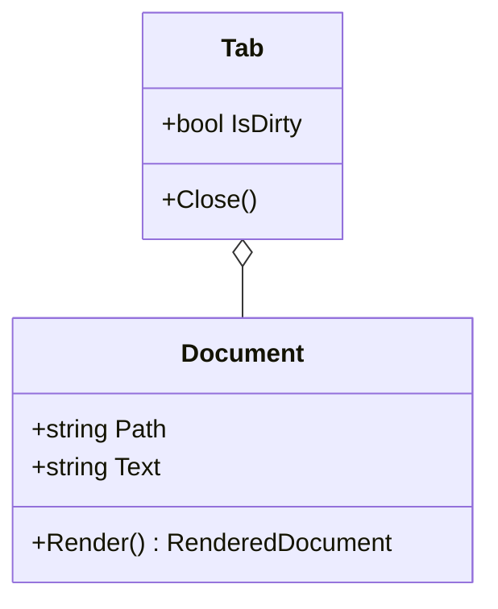
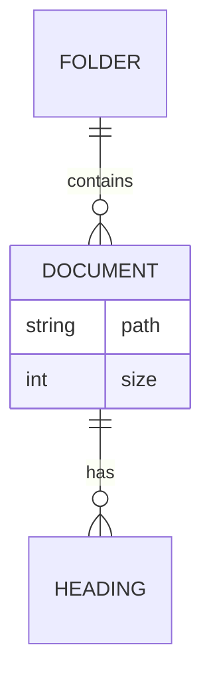
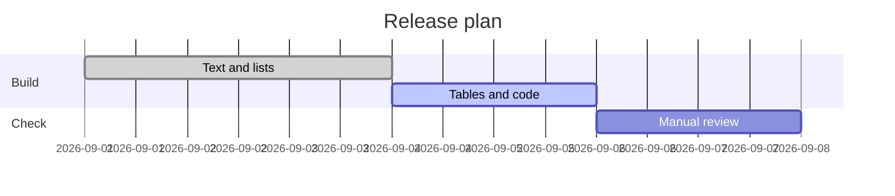
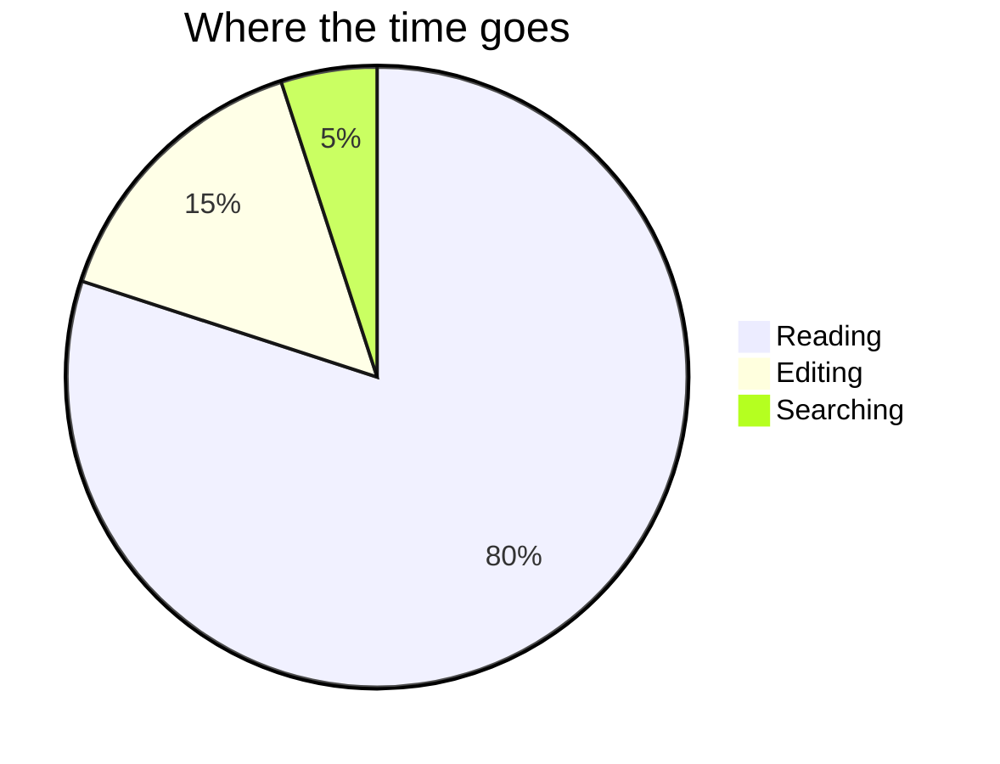
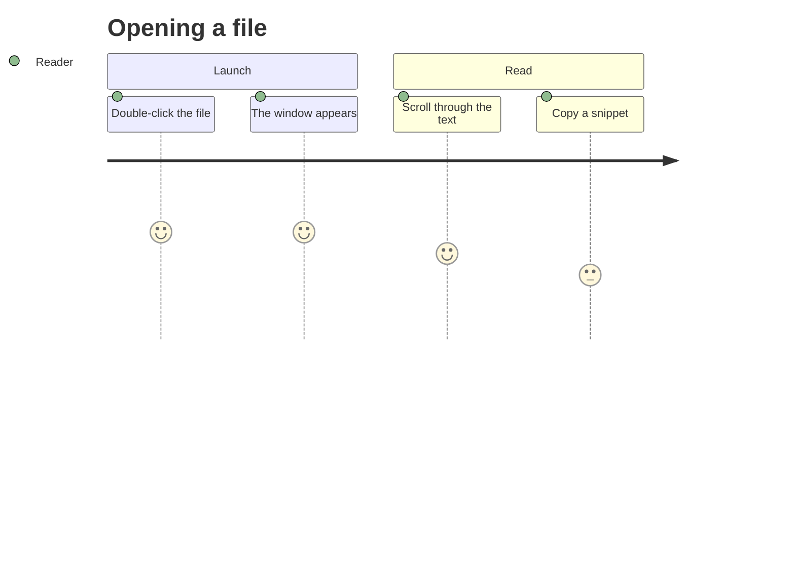
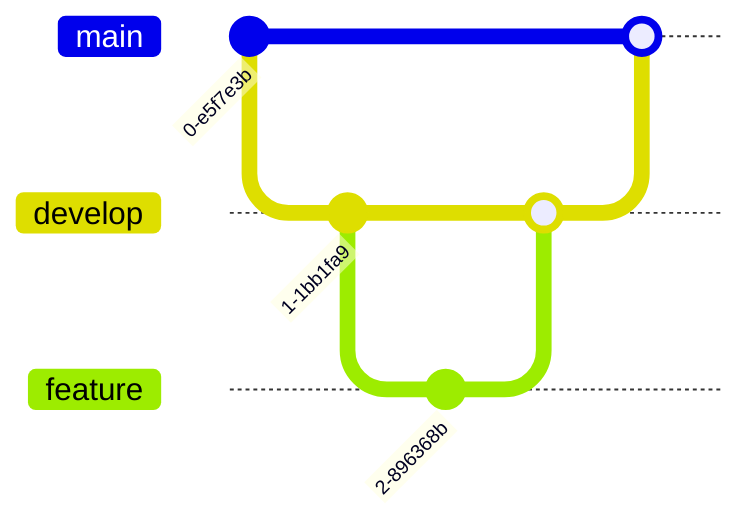
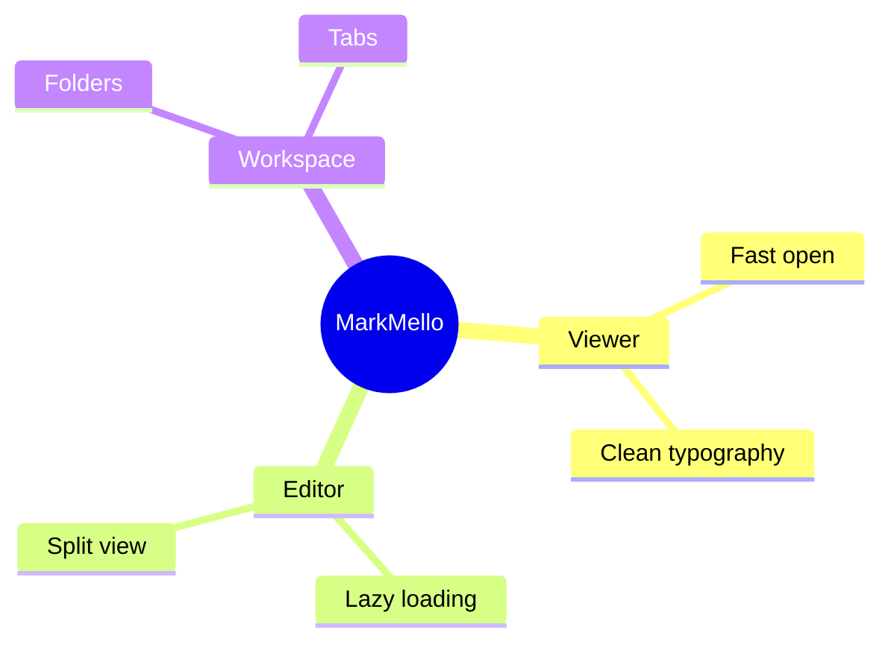

# MarkMello Markdown showcase

This file collects the common Markdown elements in one place. Open it to see how each element looks in the viewer and to spot rendering problems at a glance.

## Contents

- [Text and inlines](#text-and-inlines)
- [Lists and quotes](#lists-and-quotes)
- [Tables](#tables)
- [Code blocks](#code-blocks)
- [Links and images](#links-and-images)
- [Footnotes and rules](#footnotes-and-rules)
- [Diagrams](#diagrams)

## Text and inlines

### Headings

# Heading level 1
## Heading level 2
### Heading level 3
#### Heading level 4
##### Heading level 5
###### Heading level 6

### Emphasis

Plain text, *italic with asterisks*, _italic with underscores_, **bold with asterisks**, __bold with underscores__, ***bold italic***, and ~~strikethrough~~.

Combined: ~~**bold inside strikethrough**~~, **~~strikethrough inside bold~~**, *italic with **bold** inside*, and **bold with `code` inside**.

Strikethrough with other inlines: ~~*italic inside strikethrough*~~, ~~`code inside strikethrough`~~, ~~[a struck link](https://example.com)~~, and a price change: ~~1000 ₽~~ **800 ₽**.

#### ~~Old~~ new heading with strikethrough

### Inline code and links

Run `dotnet build MarkMello.sln`, then open a file with `Ctrl+O`. A code span with backticks inside: `` `code` ``.

A link with formatting inside: [read the **CommonMark** rules for `code spans`](https://spec.commonmark.org/0.31.2/#code-spans).

### Line breaks

A hard break with two trailing spaces:  
this line starts after the break.

A hard break with a backslash:\
this line starts after the break too.

A soft break without either
continues the same paragraph.

### Escaping and entities

Escaped characters: \*not italic\*, \_not italic\_, \`not code\`, \# not a heading, \[not a link\](nowhere), a literal backslash \\, and a literal pipe \|.

HTML entities: &copy; &reg; &trade; &amp; &lt;tag&gt; a&nbsp;non&nbsp;breaking&nbsp;phrase, an em dash &mdash; an ellipsis &hellip; an arrow &#8594; and a check mark &#x2713;.

### Inline HTML

Press <kbd>Ctrl</kbd> + <kbd>O</kbd> to open a file, or <kbd>Cmd</kbd> + <kbd>Shift</kbd> + <kbd>S</kbd> to save it under a new name on macOS.

The first line ends with a tag<br>and the second line starts right after it.

### Long words and URLs

A single long word: Donaudampfschifffahrtselektrizitätenhauptbetriebswerkbauunterbeamtengesellschaft.

A long path without spaces: /Users/reader/Documents/projects/markmello/samples/nested/folders/that/keep/going/and/going/showcase-with-a-very-long-file-name.md

A long URL without spaces: https://github.com/kostyatab/MarkMello/blob/develop/src/MarkMello.Infrastructure/Markdown/MarkdigMarkdownDocumentRenderer.cs?plain=1#L1-L400

### Long paragraph

Reading is the common case. Most of the time a Markdown file arrives from somewhere else, such as a colleague, a repository, a ticket, or a download folder, and the only thing you want is to understand what it says. That moment deserves a quiet window with good typography, a comfortable column width, and nothing that competes with the text for attention. Editing still matters, but it is the exception: you switch into it on purpose, make a change, and switch back. A long paragraph like this one checks the basics of text layout, including line height, wrapping at the edge of the reading column, the rhythm between lines, and how the paragraph sits next to the headings and lists around it. It should read as easily in the narrow column as in the wide one, and in the dark theme as in the light one.

## Lists and quotes

### Nested lists

- Level one
  - Level two
    - Level three
    - Another level three item
  - Back to level two
- Level one again

1. First step
2. Second step
   1. Sub-step A
   2. Sub-step B
      1. Detail one
      2. Detail two
3. Third step

### Mixed lists

1. Ordered item with unordered children
   - Unordered child
   - Another unordered child
     1. Ordered grandchild
     2. Another ordered grandchild
2. Ordered item without children

- Unordered item with ordered children
  1. First
  2. Second
- Unordered item without children

An ordered list that starts at seven:

7. Seventh
8. Eighth
9. Ninth

### List item with paragraphs and code

1. Install the .NET SDK.

   The project needs a recent SDK, so check the version first:

   ```bash
   dotnet --version
   ```

   If the command prints nothing, install the SDK and open a new terminal.

2. Build the solution.

   The build treats warnings as errors.

3. Open this file.

### Task list

- [x] Write the text section
- [x] Write the list section
- [ ] Review the showcase in the dark theme
  - [x] Nested done item
  - [ ] Nested open item
- A regular item in the same list

1. [x] Ordered task that is done
2. [ ] Ordered task that is open
3. A regular ordered item keeps its number

Task items with more content:

- [x] **Bold** right after the checkbox, then *italic*, `code` and a [link](https://example.com)
- [X] Checked with a capital X
- [ ] A long open task that wraps onto a second line, so the checkbox has to stay on the first line of the item text and not drift to the middle of the item
- [ ] A task with a second paragraph

  The second paragraph lines up with the text of the item, not with the checkbox.

- Brackets in the middle of an item stay text: [x] and [ ]

An empty task item:

- [ ]

### Quotes

> A single quote paragraph with ~~struck~~ text.

> Level one quote.
>
> > Level two quote.
> >
> > > Level three quote.

> **Before a release**
>
> - Run the tests
> - Measure the startup time
> - [x] Update the changelog
> - [ ] Tag the release
>
> ```bash
> dotnet test MarkMello.sln
> ```

### Alerts

> [!NOTE]
> Useful information that readers should know, even when skimming.

> [!TIP]
> Helpful advice for doing things better or more easily.

> [!IMPORTANT]
> Key information readers need to achieve their goal.

> [!WARNING]
> Urgent information that needs immediate attention to avoid problems.

> [!CAUTION]
> Advises about risks or negative outcomes of certain actions.

An alert with more content:

> [!TIP]
> **Bold**, *italic*, `code` and a [link](https://example.com) inside an alert.
>
> A second paragraph, then a list and a code block:
>
> - A regular item
> - [x] A done task
>
> ```bash
> dotnet test MarkMello.sln
> ```

The marker is case-insensitive:

> [!note]
> Written as `[!note]`.

Not alerts — these stay plain quotes and keep the marker as text:

> [!FOO]
> An unknown kind.

> [!WARNING] Text on the same line as the marker.

## Tables

### Wide table

| # | Name / Role | Type | CPU | RAM | Disk | OS | Rationale |
|---|---|---|---|---|---|---|---|
| 1 | 🌐 edge-proxy / Reverse proxy | VM | 2 vCPU | 4 GB | 40 GB SSD | Ubuntu 24.04 LTS | Terminates TLS and routes traffic to the application nodes; it holds no state, so it stays small and can be rebuilt from a template in minutes. |
| 2 | 🔐 auth / Identity provider | VM | 2 vCPU | 4 GB | 40 GB SSD | Debian 12 | Kept apart from the application nodes so that a compromised app node cannot read signing keys or session secrets directly. |
| 3 | 🧭 api-gateway / API gateway | VM | 4 vCPU | 8 GB | 60 GB SSD | Ubuntu 24.04 LTS | Applies rate limits and request validation in one place instead of repeating the same checks in every service behind it. |
| 4 | ⚙️ app-01 / Application node | VM | 8 vCPU | 16 GB | 100 GB SSD | Ubuntu 24.04 LTS | Runs the main service; sized for the daily peak with enough headroom to take the full load if the second node goes down. |
| 5 | ⚙️ app-02 / Application node | VM | 8 vCPU | 16 GB | 100 GB SSD | Ubuntu 24.04 LTS | Mirror of the first node behind the gateway, which makes rolling updates possible without a maintenance window. |
| 6 | 🗄️ db-primary / PostgreSQL primary | Bare metal | 16 cores | 64 GB | 1 TB NVMe | Rocky Linux 9 | Bare metal avoids noisy neighbours on disk I/O; the working set of the largest tables fits in memory with room to grow. |
| 7 | 🪞 db-replica / PostgreSQL replica | Bare metal | 16 cores | 64 GB | 1 TB NVMe | Rocky Linux 9 | Streaming replica for failover and for heavy read-only reports, so analytics queries never slow down the primary. |
| 8 | 📨 queue / Message broker | VM | 4 vCPU | 8 GB | 120 GB SSD | Debian 12 | Buffers background jobs and email delivery; the disk is sized to hold a full day of messages if consumers stop. |
| 9 | 🔎 search / Full-text search | VM | 8 vCPU | 32 GB | 500 GB SSD | Ubuntu 24.04 LTS | Search indexes are memory hungry; half of the RAM goes to the heap and the rest stays free for the file system cache. |
| 10 | 📈 metrics / Monitoring and logs | VM | 4 vCPU | 16 GB | 800 GB SSD | Debian 12 | Stores metrics and logs for thirty days, which covers a typical incident review and a monthly capacity report. |
| 11 | 💾 backup / Backup storage | NAS | 2 cores | 8 GB | 8 TB HDD | TrueNAS SCALE | Nightly database dumps and weekly full snapshots, kept off the main hosts so that one failure cannot take both copies. |
| — | **Total** | | 74 cores | 240 GB | ≈ 11.8 TB | | |

### Column alignment

| Left aligned | Centered | Right aligned |
|:---|:---:|---:|
| apple | 1 | 0.50 |
| banana split | 12 | 12.75 |
| cherry | 123 | 1,234.00 |

### Narrow table

| Setting | Value |
|---|---|
| Theme | Dark |
| Font | Serif |

### Mixed content

| Element | Syntax | Reference | Notes |
|---|---|---|---|
| Code span | `` `code` `` | [CommonMark](https://spec.commonmark.org/0.31.2/#code-spans) | Monospace font |
| Link | `[text](url)` | [CommonMark](https://spec.commonmark.org/0.31.2/#links) | |
| Escaped pipe | `a \| b` | | The pipe stays inside the cell |
| Empty cells | | | |
| Formatting | `**bold**` | [GFM](https://github.github.com/gfm/#tables-extension-) | **bold**, *italic*, ~~struck~~ |

## Code blocks

### Without a language

A wide block with lines longer than the reading column:

```
2026-09-18T09:14:03.512Z INFO  MarkMello.Desktop.Program  Startup stage FirstFrame reached in 187 ms (document=/Users/reader/Documents/projects/markmello/samples/showcase.md)
2026-09-18T09:14:03.640Z WARN  MarkMello.Infrastructure.Markdown  Image '../assets/does-not-exist.png' could not be loaded: file not found, a placeholder is shown instead of the image
2026-09-18T09:14:03.702Z INFO  MarkMello.Presentation.Views.MarkdownDocumentView  Document rendered: 412 blocks, 7 diagrams, 5 images, 1 wide table with 8 columns and 12 rows
```

A short block:

```
Hello, MarkMello.
```

An indented code block:

    $ markmello ./samples/showcase.md
    Opened showcase.md in 142 ms

### With a language

```json
{
  "theme": "dark",
  "fontFamily": "serif",
  "columnWidth": "medium",
  "lineHeight": 1.7,
  "recentFiles": ["~/notes/today.md", "~/projects/markmello/README.md"],
  "diagnostics": { "startupTrace": false }
}
```

```csharp
public sealed record ReadingPreferences(
    string Theme,
    string FontFamily,
    double LineHeight = 1.7);
```

```yaml
name: tests
on:
  push:
    branches: [develop]
jobs:
  test:
    runs-on: ${{ matrix.os }}
    strategy:
      matrix:
        os: [ubuntu-latest, windows-latest, macos-latest]
    steps:
      - uses: actions/checkout@v4
      - run: dotnet test MarkMello.sln
```

```diff
 ## Reading preferences
 
-| Line height   | 1.4 – 1.8                  | 1.6     |
+| Line height   | 1.4 – 2.0                  | 1.7     |
 
 Changes apply instantly.
```

### A long block

```csharp
using System;
using System.Collections.Generic;
using System.IO;
using System.Linq;

namespace Showcase;

public static class WordStatistics
{
    private static readonly char[] Separators =
    [
        ' ', '\t', '\r', '\n', '.', ',', ';', ':', '!', '?', '(', ')', '"'
    ];

    public static IReadOnlyList<(string Word, int Count)> TopWords(string path, int limit)
    {
        ArgumentException.ThrowIfNullOrWhiteSpace(path);
        ArgumentOutOfRangeException.ThrowIfNegativeOrZero(limit);

        var counts = new Dictionary<string, int>(StringComparer.OrdinalIgnoreCase);

        foreach (var line in File.ReadLines(path))
        {
            if (line.StartsWith("```", StringComparison.Ordinal))
            {
                continue;
            }

            foreach (var word in line.Split(Separators, StringSplitOptions.RemoveEmptyEntries))
            {
                if (word.Length < 3)
                {
                    continue;
                }

                counts[word] = counts.TryGetValue(word, out var count) ? count + 1 : 1;
            }
        }

        return counts
            .OrderByDescending(pair => pair.Value)
            .ThenBy(pair => pair.Key, StringComparer.OrdinalIgnoreCase)
            .Take(limit)
            .Select(pair => (pair.Key, pair.Value))
            .ToList();
    }
}
```

## Links and images

### Links

- An anchor to a heading in this file: [jump to the tables](#tables).
- A link to a local file: [the startup reference document](../sample.md).
- An external link: [CommonMark](https://commonmark.org).
- An external link with a title: [Markdig](https://github.com/xoofx/markdig "Markdig on GitHub").
- An autolink: <https://github.com/kostyatab/MarkMello>.
- A bare URL: https://commonmark.org/help/

### Images

A local image:


An image with a broken path:


A remote image:


An image embedded as a data URI:  inside a sentence.

An HTML image with a fixed width:


## Footnotes and rules

### Footnotes

MarkMello renders Markdown with Markdig[^markdig] and draws diagrams without a browser engine[^diagrams]. A footnote can also be referenced twice[^markdig].

[^markdig]: Markdig is a fast, CommonMark-compliant Markdown processor for .NET.

[^diagrams]: Diagrams are rendered in-process.

    A footnote can have more than one paragraph, indented like this one.

The footnotes themselves are listed at the very end of this document, after the diagrams. A label jumps to its footnote, and the number of the footnote jumps back to the label.

Labels in formatted text: **inside bold[^formatted]**, *inside italic[^formatted]*, and right after `code`[^formatted] — one footnote referenced three times keeps one number.

> A quote with a footnote[^quote].

- A list item with a footnote[^list]

| Column | With a footnote |
|--------|-----------------|
| Cell   | Value[^table]   |

A label can be any word or number: footnotes are numbered by their first reference, not by their labels[^9].

A footnote can hold a list and a code block[^blocks].

Not footnotes — a label without a definition stays text: [^missing]. A footnote nobody refers to is not shown at all.

[^formatted]: Referenced from bold, italic and after inline code.

[^quote]: Referenced from a quote.

[^list]: Referenced from a list item.

[^table]: Referenced from a table cell.

[^9]: Labelled `9`, but numbered by its place in the text.

[^blocks]: The footnote starts with a paragraph:

    - a list item
    - another list item

    ```bash
    dotnet test MarkMello.sln
    ```

[^unused]: Nobody refers to this footnote, so it is not shown.

### Horizontal rules

Three hyphens:

---

Three asterisks:

***

Three underscores:

___

## Diagrams

### Class diagram



### Entity relationship diagram



### Gantt chart



### Pie chart



### User journey



### Git graph



### Mind map



### A diagram with a syntax error

```mermaid
flowchart LR
    A[Open file] --> B{Parse
    B -->|ok| C[Render
    C ==>
```
