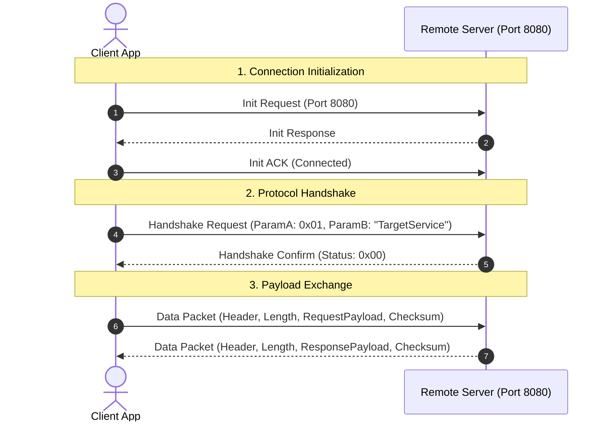

```mermaid
%%{init: {
  "sequence": {
    "width": 240,
    "actorMargin": 120,
    "messageMargin": 45
  }
}}%%

sequenceDiagram
    autonumber
    actor Client as Client App
    participant Server as Remote Server (Port 8080)

    Note over Client, Server: 1. Connection Initialization
    Client->>Server: Init Request (Port 8080)
    Server-->>Client: Init Response
    Client->>Server: Init ACK (Connected)

    Note over Client, Server: 2. Protocol Handshake
    Client->>Server: Handshake Request (ParamA: 0x01, ParamB: "TargetService")
    Server-->>Client: Handshake Confirm (Status: 0x00)

    Note over Client, Server: 3. Payload Exchange
    Client->>Server: Data Packet (Header, Length, RequestPayload, Checksum)
    Server-->>Client: Data Packet (Header, Length, ResponsePayload, Checksum)
```
